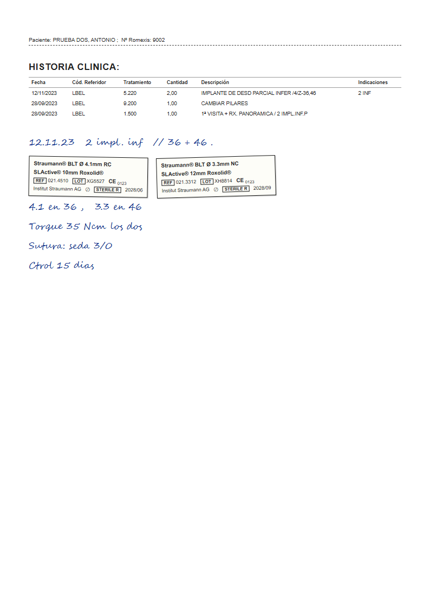
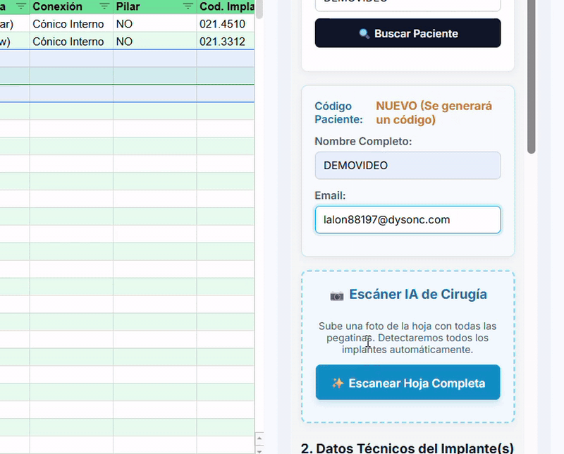

# Implant Passport Scanner

AI-powered digital implant passport, **live in production at a real dental clinic**
([Clínica Drs. Pi y Esteller](https://clinicapiesteller.com/), Barcelona — see the
*Pasaporte Implantológico* section, or the patient portal directly at
[clinicapiestellercom.netlify.app](https://clinicapiestellercom.netlify.app/)).

Dental clinics are required to hand patients a record of every implant placed: brand,
model, reference, lot number, diameter, length, tooth position. In practice that data
lives on **sticker labels glued into scanned paper charts, surrounded by handwritten
surgical notes**. Transcribing it by hand is slow and error-prone — and errors in a
lot number or reference matter when an implant is ever recalled or retreated.

This project replaces that transcription with a scanner: staff drop the scanned chart
into a sidebar, a dual-model vision pipeline extracts every implant with its full
data, staff review and save, and the patient gets a permanent online passport they
can open with their personal access code (see [ADR 0003](docs/adr/0003-acceso-al-portal-solo-con-el-codi.md)).



*A synthetic test scan (no real patient data — see [Test data](#test-data-real-vs-synthetic)).
The scanner reads both the printed sticker fields (REF, LOT, Ø, length) and the
handwritten notes that carry the tooth position and placement date.*

## Architecture

```
                         STAFF SIDE (Google Workspace)
  scanned chart (PDF/JPG)
        |
        v
  Google Sheets sidebar (SidebarForm.html)
        |
        v
  ScanEngine.js  -- shared module, runs in Apps Script AND Node
        |-- primary:  Gemini API (direct, free tier, model auto-discovery)
        |-- fallback: OpenRouter google/gemini-2.5-flash (paid, ~$0.001/scan,
        |             only reached when the free primary fails)
        v
  editable review form -> hard validation (FDI tooth position required)
        |
        v
  Google Sheet (patient + implant registry)  <- also: bulk import, dedup,
        |                                       catalog auto-update
        v
                         PATIENT SIDE
  clinic website -> Netlify page (web/) -> Apps Script web app (Index.html)
  patient enters personal access code -> implant passport (whitelisted fields only)
```

The interesting engineering lives in `src/ScanEngine.js` and `test/`:

- **One module, two runtimes.** ScanEngine runs unchanged inside Google Apps Script
  (production) and Node (test harness) via dependency-injected HTTP fetch. That is
  what makes a live-API accuracy suite possible for a GAS app.
- **Deliberate fallback economics.** The fallback was originally "any free model" —
  benchmarking every free vision model against golden fixtures showed they were
  429-saturated, timed out (>60 s GAS limit), or misread stickers. The fallback is
  now the *paid* `google/gemini-2.5-flash` via OpenRouter, hard-pinned by guard
  tests: changing the model requires a conscious edit in two places and a
  re-benchmark against the goldens.
- **Honest error classification.** Provider errors carry their HTTP status; the user
  only sees "daily limit reached" when *both* providers actually return 429.
  Authorization failures are rethrown so the UI can show re-auth instructions —
  this distinction was learned the hard way when an OAuth-scope change was
  mislabeled as a quota error in production.
- **Self-diagnosis in production.** A "🩺 Comprobar escáner" menu checks each layer
  (permissions, keys, Gemini, OpenRouter) with per-layer fix instructions. On its
  first run it caught a real bug: a stale API key in Script Properties returning 401.

## Test harness

```
npm test                        # offline unit tests vs golden fixtures (no key needed)
npm run test:accuracy           # LIVE Gemini scan of every sample vs goldens
npm run test:accuracy:fallback  # LIVE OpenRouter fallback path (Gemini forced down)
npm run test:accuracy:bothdown  # both providers down -> graceful failure (offline)
npm run generate-fixtures       # rebuild fixtures/goldens from the sample PDFs
```

Accuracy comparison (`test/compareGolden.js`) is **strict on critical sticker fields**
(lot, reference, diameter, length — a mistake there is a clinical-safety problem) and
**report-only on soft fields** (brand naming, connection type, position), because live
model drift was observed on unchanged prompts. Position ambiguity is handled in the
product, not hidden in the tests: unresolved positions hard-block saving behind a
required FDI dropdown, and doubtful scans increment a counter for monitoring.

## Test data: real vs synthetic

The committed samples (`test/synthetic-*.pdf`) are **fully synthetic**: authored as
HTML (`test/synthetic-src/`) mimicking the real chart layout — treatment table,
implant sticker, handwritten notes in a script font — and rendered to PDF with
headless Chrome. No real patient data exists anywhere in this repository or its
history. Real scans live in a gitignored `test/private/` set that the harness picks
up automatically on machines that have it.

One honest caveat: synthetic PDFs are digitally rendered, so they scan cleaner than
production photo-scans of glued stickers. The production accuracy story is the
private golden set, run against both providers on every change.

## Live demo

Open a real passport right now, no setup:

1. Go to [clinicapiestellercom.netlify.app](https://clinicapiestellercom.netlify.app/)
2. Enter the demo code: **`DEMO2026`**
3. You get the passport of a fictitious patient (synthetic data, clearly
   banner-labeled) with two Straumann implants — the same implants described in
   [`test/synthetic-2.pdf`](test/synthetic-2.pdf), the committed sample the
   scanner reads in the test harness.

The demo patient works exactly like a real one: the access code alone opens the\npassport. The server only ever returns whitelisted fields (no email, no internal\nIDs, the national ID masked), and a global rate limit pauses the portal after\nrepeated wrong codes.



*Full ~60s walkthrough (scan → AI fill → save → automatic email → portal → passport) posted on [LinkedIn](https://www.linkedin.com/in/gabriel-lópez-maza-795179335/).*

## Try it

```bash
git clone https://github.com/ProGabo/implant-passport-scanner.git
cd implant-passport-scanner
npm test                                    # runs offline, no API key needed
# for live scans: put GEMINI_API_KEY=... in .env (free at aistudio.google.com), then
npm run test:accuracy
```

## Repository layout

```
src/        Apps Script app (pushed with clasp): Código.js, ScanEngine.js,
            SidebarForm.html (staff sidebar), Index.html (patient portal)
test/       Node test harness: unit tests, golden fixtures, live accuracy suites,
            synthetic sample generator (synthetic-src/)
web/        static clinic page deployed on Netlify (embeds the patient portal)
docs/       images and docs
sessions/   dated engineering session logs (kept public as a record of how
            production issues were actually diagnosed and fixed)
```

## Known limitations

- On chart pages with several *identical* implants, both providers occasionally
  duplicate a tooth position (e.g. 11/21). Mitigated in the product: positions are
  editable at review time and flagged with a "REVISAR POSICIÓN" warning.
- The UI is Spanish — it is a production tool for a Spanish clinic, not a demo.
- Free-tier Gemini quota can run out on heavy days; that is exactly what the paid
  bounded fallback is for.

## Status

In production at Clínica Drs. Pi y Esteller (Barcelona). Built and maintained by
[Gabriel López](https://github.com/ProGabo).
